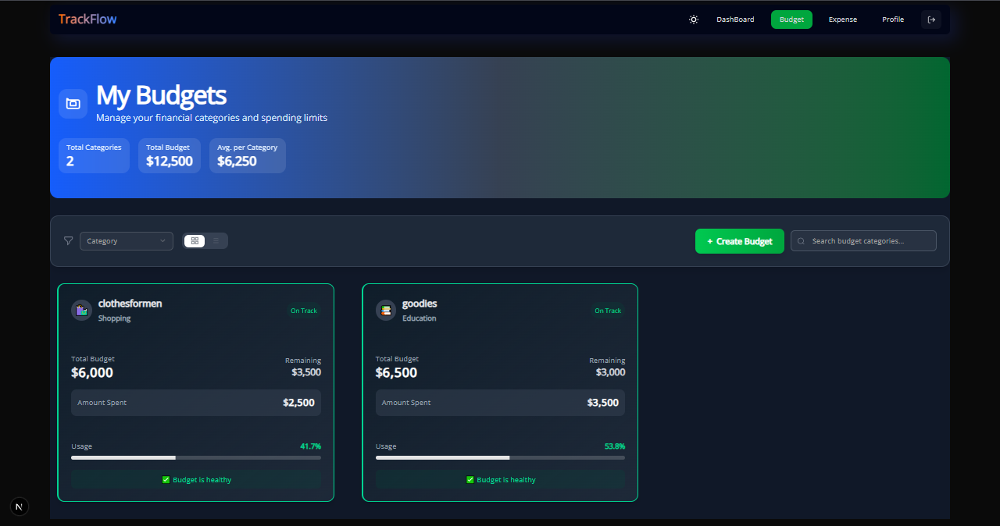
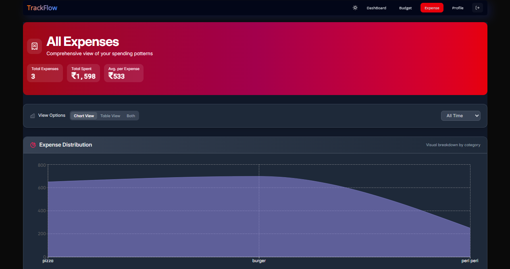

# Expense Tracker 💸

A modern **Next.js 14** web app that lets you create budgets, log expenses, and visualise spending with interactive charts—all backed by **Appwrite** and styled with **Tailwind CSS**.

---

## ✨ Features

- **Multi-budget support** – create separate budgets for work, travel, hobbies, etc.
- **Real-time expense logging** with category tags and notes.
- **Interactive dashboards** – pie charts for category splits, stacked bars for budget vs. spend.
- **Authentication & secure storage** via Appwrite.
- **Dark mode** toggle with local-storage persistence.
- **Responsive UI** built with shadcn/ui and magic/ui components.

---

## 🖥️ Demo

[track-yours-expense.netlify.app](https://track-yours-expense.netlify.app/)

---

## 📸 Screenshots

| Budgets                    | New Expense                    |
| -------------------------- | ------------------------------ |
|  |  |

---

## 🚀 Tech Stack

| Frontend   | Backend     | Styling         | Data Viz                |
| ---------- | ----------- | --------------- | ----------------------- |
| Next.js 14 | Appwrite v1 | Tailwind CSS v4 | React Charts / recharts |

---

## 🏗️ Project Structure

src/
├── 📁 app/
│ └── 📁 (pages)/
│ ├── 🔐 checkUser.js # User auth validation
│ ├── 🎨 globals.css # Tailwind & global styles
│ ├── 🏗️ layout.js # App shell & providers
│ ├── 🏠 page.js # Landing/dashboard page
│ └── 🔄 storeProvider.js # Redux store wrapper
├── 🚀 appwrite/ # Backend SDK & config
├── 🧩 components/ # UI components library
├── ⚙️ conf/ # Environment & settings
├── 🛠️ lib/ # Utilities & helpers
└── 🗃️ store/ # State management (Redux)

---

## 🔧 Prerequisites

- **Node 18 LTS+** (Node 20 recommended) - JavaScript runtime
- **Next.js 14+** - React framework for production
- **Redux Toolkit** - Global state management
- **Shadcn/ui** - Copy-paste component library
- **Magic UI** - Animated component effects
- **Appwrite** (cloud or self-hosted) - Auth & database backend
- **Netlify/Vercel** (optional) - Hosting platform

---

## 🛠️ Local Setup

1. Clone
   git clone https://github.com/Roy0544/Expense-Tracker.git
   cd Expense-Tracker

2. Install deps
   pnpm install # or npm / yarn / bun

3. Configure env
   cp .env.example .env.local

→ add NEXT_PUBLIC_APPWRITE_ENDPOINT, PROJECT_ID, etc. 4. Run dev server
pnpm dev

open http://localhost:3000

---

## ⚙️ Environment Variables

| Name                                    | Example                        | Description                      |
| --------------------------------------- | ------------------------------ | -------------------------------- |
| `NEXT_PUBLIC_APPWRITE_ENDPOINT`         | `https://cloud.appwrite.io/v1` | Appwrite API endpoint            |
| `NEXT_PUBLIC_APPWRITE_PROJECT_ID`       | `6570abcd1234`                 | Project ID                       |
| `NEXT_PUBLIC_APPWRITE_DATABASE_ID`      | `expenses_db`                  | DB holding budgets & expenses    |
| `NEXT_PUBLIC_APPWRITE_EXPENSE_TABLE_ID` | `expenses_db`                  | TABLE holding expenses           |
| `NEXT_PUBLIC_APPWRITE_BUDGET_TABLE_ID`  | `expenses_db`                  | TABLE holding budgets & expenses |

---

## 📈 Usage Tips

1. Create a budget from **Dashboard → “New Budget”**.
2. Add expenses with **“+ Expense”**; assign category & amount.
3. View summary charts; hover segments for values.
4. Edit or delete items inline; totals update instantly.

---

## 🗺️ Roadmap

**Phase 1 (Current)**

- [x] Expense tracking with Graphs
- [x] Budget creation and management
- [x] Dark mode toggle

---

## 🤝 Contributing

1. Fork the repo and create a feature branch.
2. Follow the **Conventional Commits** spec for commit messages.
3. Submit a pull request; please include unit tests where applicable.

---

## 🪪 License

MIT © 2025 Roy0544  
See `LICENSE` for details.
